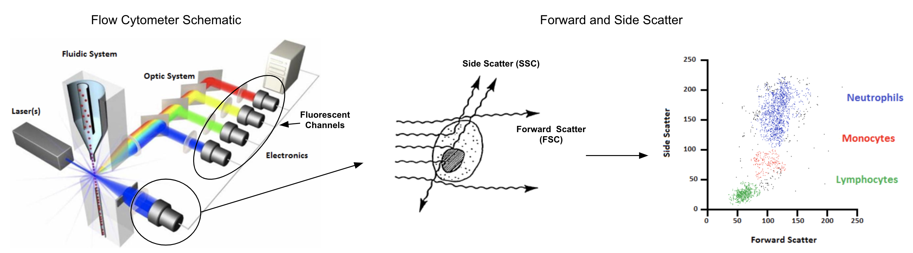
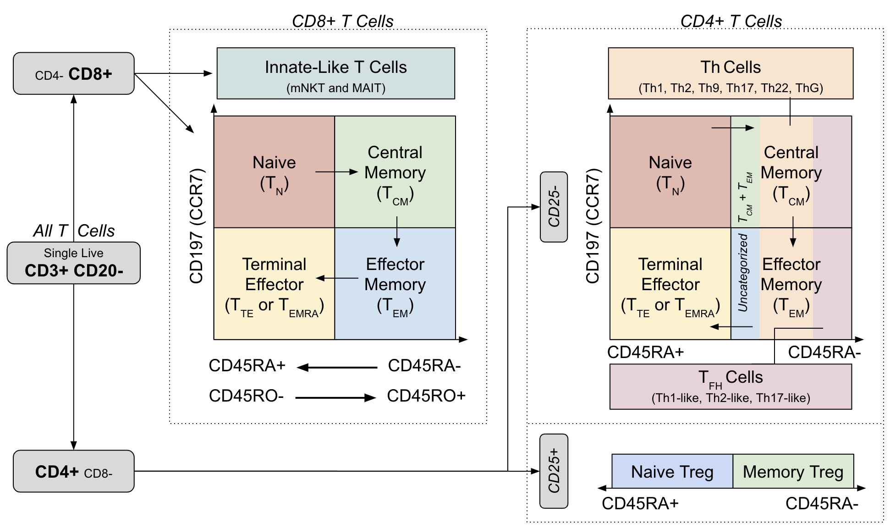

# Flow {#flow}

```{r flow-options, include=FALSE}
library(knitr)
opts_chunk$set(results='hide', warning=FALSE, message=FALSE)
```

```{r flow-libraries}
# Publication-related
library(kableExtra)
options(kableExtra.html.bsTable = T)

# Bioconductor
library(FlowRepositoryR)
library(flowCore)
library(openCyto)
library(ggcyto)
library(FlowSOM)

# Tidyverse
library(fs)
library(janitor)
library(tidyverse)
library(reshape2)

# General purpose
library(curl)

# Visualization
library(umap)
```

```{r flow-theme, include=FALSE}
# Set common ggplot theme
flow_theme <- theme_bw() + theme(
  panel.grid.minor.x=element_blank(),
  panel.grid.minor.y=element_blank(),
  panel.grid.major.x=element_blank(),
  panel.grid.major.y=element_blank()
)
```

## Overview

Flow Cytometry is a common technique employed in the field of immunology that quantifies characteristics of individual cells. Early flow cytometer designs date back to the first of half of the 20th century and while it wasn't until the late 1960's that the predecessors of modern fluorescence-based flow cytometers were first patented, the basic principles of these instruments have not changed in the intervening 50 years until today [@Givan2010-no].  They operate by passing single cells through a sheath fluid that arranges them in a single file order and then into an interrogation point (often at a rate of thousands of cells per second or more) where visible light from lasers excite antibody-bound fluorophores or fluorescent dyes specific to chemicals, usually proteins, on or within each cell.  

The data collected from a flow cytometer for each cell includes measurements for forward scatter (FSC), side scatter (SSC), and fluorescent marker intensities.  The first two of these, FSC and SSC, are briefly explained in \@ref(fig:flow-schematic) [@Rowley2012-mq] and measure morphological properties of cells while fluorescent intensities are the focus of the remaining analysis in this chapter.  This analysis will also focus on several other key concerns in working with flow cytometry data like compensation, transformation, and automation through the use of several related Bioconductor packages.  Most of these packages make use of  [flowCore](http://bioconductor.org/packages/release/bioc/html/flowCore.html) [@Hahne2009-io] and while some of the details of its utilization will be explained, it's probably worth giving the [vignette](http://bioconductor.org/packages/release/bioc/vignettes/flowCore/inst/doc/HowTo-flowCore.pdf) a quick browse before going further since some familiarity of FCS files, ```flowFrame``` constructs, and ```GatingHierarchy``` semantics will be assumed (though much of this is pretty intuitive given working R knowledge).


```{r flow-schematic, results='asis', fig.align='center', fig.cap='Forward and side scatter measure cell size and internal complexity, both of which are useful for QA purposes and cell type identification', echo=FALSE}

```

For more references on flow cytometry analysis and applications, see:

- [Practical Flow Cytometry](https://www.wiley.com/en-us/Practical+Flow+Cytometry%2C+4th+Edition-p-9780471411253) [@Shapiro1994-ri]: An in-depth text with details on advanced topics such as cell sorting, single molecule detection, and applications of flow in hematology, immunology, microbiology, food science, bioterrorism, and more
- [Translational Applications of Flow Cytometry in Clinical Practice](http://www.jimmunol.org/content/188/10/4715) [@Jaye2012-vc]: An overview of clinical applications in cancer and immunological disease diagnosis as well as cell therapy
- [Critical assessment of automated flow cytometry data analysis techniques](https://www.nature.com/articles/nmeth.2365) [@Aghaeepour2013-xo]: A presentation of results from an analytical competition ([FlowCAP](http://flowcap.flowsite.org/)) held to assess the performance of algorithmic advancements in flow cytometry data processing

## Exploring FlowRepository

While many sources of public flow cytometry data exist, the subject of this chapter will be experiments uploaded to [FlowRepository](https://flowrepository.org/).  Specifically, the [FlowRepositoryR](https://bioconductor.org/packages/release/bioc/html/FlowRepositoryR.html) package will be used to download two datasets related to ["Optimized Multicolor Immunophenotyping Panels" (OMIP)](https://fluorofinder.com/omips/) publications.  These panels consist of dyes and antibodies used to label samples relevant for one specific experimental purpose such as characterizing natural killer cell populations or chemokine expression on helper T cells.  

Data available from these publications may be found in FlowRepository simply by searching for studies containing the keywork "OMIP".  Using the FlowRepository site is generally the simplest way to find relevant studies but programmatic access can also be helpful for doing more targeted searches such as for studies that have an associated FlowJo workspace, as shown below.

```{r flow-repository-search-example, results='asis'}
# Search for all studies matching the OMIP keyword (which returns a list of string IDs) and then
# fetch all corresponding details for the first 25
studies <- flowRep.search('OMIP') %>% sort %>% head(25) %>% map(flowRep.get)

# Study objects are implemented as S4 classes with id and name slots as well as an attachments slot, 
# which is a list further containing S4 objects (with a "name" slot having values like "20151210_Workspace.jo")
tibble(
  id=studies %>% map_chr(~ .@id),
  name=studies %>% map_chr(~ .@name),
  panel=name %>% str_extract('(?<=OMIP-)\\d+') %>% as.integer,
  has_flowjo_ws=studies %>% map_lgl(~ map(.@attachments, ~.@name) %>% str_detect('\\.jo|\\.wsp') %>% any)
) %>% 
  filter(has_flowjo_ws) %>% 
  select(-has_flowjo_ws) %>% 
  arrange(panel) %>%
  kable
```

## Tools

TODO: 

- Intro [openCyto](https://bioconductor.org/packages/release/bioc/html/openCyto.html) and [flowWorkspace](http://bioconductor.org/packages/release/bioc/html/flowWorkspace.html) 
- Explain how R tools are most appropriate for automated workflows (not manual gating)
- Explain single-step automation vs whole workflow automation
- Describe FlowJo and Cytobank

## Simple Analysis Automation (OMIP-021)

Initial Example: [OMIP-021: Innate-like T-cell Panel (FR-FCM-ZZ9H)](https://flowrepository.org/id/FR-FCM-ZZ9H)

```{r flow-load-OMIP-data, results='asis'}
data_dir <- dir_create("data/flow_files/OMIP-021")
dataset_id <- "FR-FCM-ZZ9H"
dataset_path <- fs::path(data_dir, dataset_id)
dataset <- flowRep.get(dataset_id)

if (!dir_exists(dataset_path))
  dataset <- download(dataset, dirpath=dataset_path, only.files="Donor.*fcs", show.progress=F)
fr <- read.FCS(fs::path(getwd(), dataset_path, 'Donor1.fcs'))
fr %>% exprs %>% as.tibble %>% head(10) %>% 
  kable(format.args = list(digits=3)) %>%
  kable_styling() %>%
  scroll_box(width="100%")
```

In this dataset, one way to identify lymphocytes is by looking at modes in the relationship between side and forward scatter:

```{r flow-example-biplot}
ggcyto(fr, aes(x='FSC-A', y='SSC-A')) + geom_hex(bins=100)
```


To identify the lymphocyte cells above, ```openCyto``` gating can be used to select the largest cluster of cells automatically and visualize what fraction of the population these cells constitute:

```{r flow-example-flow-clust-gate}
gate <- openCyto::flowClust.2d(fr, 'FSC-A', 'SSC-A', K=3, quantile=.9)
ggcyto(fr, aes(x='FSC-A', y='SSC-A')) + geom_hex(bins=100) + geom_gate(gate) + geom_stats()
```


### Gating

By repeating the above process for all cell types of interest in the paper, the workflow can be reproduced via a [GatingTemplate](https://www.bioconductor.org/packages/devel/bioc/vignettes/openCyto/inst/doc/HowToWriteCSVTemplate.html) as shown below, which could also be built programmatically instead.  The graphical representation of the template shows how cell types will be recursively defined based on 2 dimensional filters:

```{r flow-plot-gating-template, results='asis'}
template <- 'alias,pop,parent,dims,gating_method,gating_args,collapseDataForGating,groupBy,preprocessing_method,preprocessing_args
Live,+,root,"FSC-A,525/50Violet-A","polyGate","x=c(0,3e5,3e5,1e5,.5e5,0),y=c(0,0,2.3,2.3,2,1.5)",,,,
Lymphocytes,+,Live,"FSC-A,SSC-A","flowClust.2d","K=3,quantile=.95",,,,
Singlets,+,Lymphocytes,"FSC-A,FSC-H","singletGate","maxit=1000,wider_gate=T,prediction_level=.999999999",,,,
gdTCells,+,Singlets,"670/30Violet-A,530/30Blue.A","flowClust.2d","K=3,target=c(2.5,2.5)",,,,
abTCells,+,Singlets,"670/30Violet-A,530/30Blue.A","flowClust.2d","K=3,target=c(2.5,1),quantile=0.95",,,,
maiTCells,+,abTCells,"582/15Yellow.A,540/30Violet.A","polyGate","x=c(2.7,5,5,2.7),y=c(2.5,2.5,5,5)",,,,'
template_path <- file_temp(ext='.csv')
write_lines(template, template_path)
gt <- gatingTemplate(template_path)
plot(gt)
```

The above template only outlines the gating workflow but to apply it to our data, these are the common steps:

- Apply compensation to the raw FCS data if necessary (not necessary in this case as the authors did this beforehand)
- Define channel transformations to make gating and visualization possible
- Define any custom gating functions needed in the workflow, which is particularly useful for setting manual gates
- Apply the gating template to the data at hand, which in this case is represented as a ```flowFrame``` but could also be a ```flowSet``` representing a collection of experiments

Here is the realization of these steps for this data specifically:

```{r flow-plot-poly-gate}
# Define logical transformation for all fluorescent channels and build a "GatingSet", which is a wrapper
# class that binds numeric data with transformations and gating information
transformer <- transformerList(colnames(fr@description$SPILL), logicle_trans())
gs <- transform(GatingSet(flowSet(fr)), transformer)

# Define a custom polygon gating function, that is used in our template to deal with situations
# that are difficult to define an automated gate for
.polyGate <- function(fr, pp_res, channels, filterId="polygate", ...){
  args <- list(...)
  g <- data.frame(x=args$x, y=args$y)
  colnames(g) <- channels
  flowCore::polygonGate(.gate=g, filterId=filterId)
}
registerPlugins(fun=.polyGate, methodName='polyGate', dep=NA)

# Apply the gating to the data (this may take a couple minutes)
gating(gt, gs)
```

### Results

Now that the workflow is finished, here is a look at all cell types identified:

```{r flow-plot-cell-types, fig.height=8, fig.width=8}
autoplot(gs[[1]], strip.text = "gate", bins=100, merge=F, axis_inverse_trans=F) + flow_theme
```

This should then be comparable to what was in the [OMIP-021 publication](https://onlinelibrary.wiley.com/doi/full/10.1002/cyto.a.22475), and here are relevant figures demonstrating the similarity of the cell subsets captured:

```{r flow-OMIP-021-figure, results='asis', fig.align='center', fig.cap='Gating strategy illustrated with annotated figures from OMIP-021', echo=FALSE, out.width = '100%'}
knitr::include_graphics('images/flow-OMIP021-populations.png')
```

## Advanced Analysis Automation (OMIP-030)

Advanced Example: [OMIP-030: Characterization of eight major human CD4+ T helper subsets, including Tregs, via surface markers (FR-FCM-ZZWU)](https://flowrepository.org/id/FR-FCM-ZZWU)

### Gating

Load a flow workspace, which will contain all gaiting and cell expression information:

```{r flow-load-workspace}
data_dir <- dir_create('data/flow_files/OMIP-030')
zip_url <- 'https://storage.googleapis.com/t-cell-data/flow_files/OMIP-030.zip'
zip_file <- fs::path(data_dir, 'OMIP-030.zip')
if (!file_exists(zip_file)) {
  curl_download(zip_url, zip_file) %>% unzip(exdir=data_dir)
}
ws <- openWorkspace(fs::path(data_dir, 'OMIP-030.wsp'))
gs <- parseWorkspace(ws, name='TCells', path=data_dir, isNcdf=FALSE)

# Extract single GatingHierarchy from GatingSet
gh <- gs[[1]]
```

Show the correspondence between the flow cytometer channels and the marker names in the panel.

```{r flow-show-markers, results='markup'}
getData(gh)@parameters@data %>% select(name, desc) %>% kable
```

Plot the gating workflow starting from where T Cells are first identified:

```{r flow-show-workflow, fig.width=14, fig.height=8}
plot(gs, 'T Cells', width=6, height=1, fontsize=18, shape='rectangle')
```


TODO: Explain gating via differentiation model

```{r flow-OMIP-030-figure, results='asis', fig.align='center', fig.cap='Gating strategy and cell differentiation overlay from OMIP-030', echo=FALSE}

```

### Extracting Single Cell Data

Identify terminal nodes (i.e. cell populations) in the workflow which were, by convention, prefixed with either ```CD4+``` or ```CD8+``` and then use those nodes to extract single-cell data into a data frame (useful for custom visualizations).

TODO: make display of pop names better (and make states a map from type?)

```{r flow-cell-metadata, results='asis'}
# Extract all terminal node names into a vector
cell_pops <- getNodes(gs, path=1) %>% keep(str_detect(., '^CD[4|8]\\+ .*'))

# Functions used to parse properties out of node cell population
cell_pop_to_class <- function(x) case_when(
  str_detect(x, '^CD4\\+') ~ 'CD4+',
  str_detect(x, '^CD8\\+') ~ 'CD8+',
  TRUE ~ NA_character_
)
cell_pop_to_mem_state <- function(x) case_when(
  str_detect(x, '^CD[4|8]\\+ CM') ~ 'CM',
  str_detect(x, '^CD[4|8]\\+ EM') ~ 'EM',
  str_detect(x, '^CD[4|8]\\+ Naive$') ~ 'Naive',
  str_detect(x, '^CD[4|8]\\+ Effector$') ~ 'EMRA',
  TRUE ~ NA_character_
)
  
# Create vectors of all distinct cell states and types
cell_states <- cell_pops[!is.na(cell_pop_to_mem_state(cell_pops))]
cell_types <- discard(cell_pops, ~. %in% cell_states)

tibble(
  population=cell_pops, 
  state=cell_pops %>% cell_pop_to_mem_state, 
  class=cell_pops %>% cell_pop_to_class
) %>% kable
```

Next, extract data from the ```flowFrame``` using the ```getIndices``` function which, for a given list of ```m``` node names, returns an ```n``` x ```m``` matrix where ```n``` is the number of cells and ```m``` logical columns contain ```TRUE/FALSE``` values indicating whether or not the cell (row) was in that population.


```{r flow-cell-data-extraction, results='asis'}
extract_node_assignment <- function(nodes) {
  nodes %>% map(~getIndices(gh, .)) %>% bind_cols %>% 
    set_names(nodes) %>% apply(., 1, function(x){
      if (sum(x) == 1) nodes[x] 
      else NA_character_
    })
}

# Separately query the single cells to determine state and type (as well as a few other metadata properties)
df_cell_meta <- list(type=cell_types, state=cell_states) %>% 
  map(extract_node_assignment) %>% as_tibble %>%
  mutate(type=coalesce(type, state)) %>%
  mutate(state=replace_na(cell_pop_to_mem_state(state), 'None')) %>%
  mutate(class=cell_pop_to_class(type)) %>%
  # Collapse these incorrect node names (there is a typo in the OMIP-030 CD4 gating figure)
  # TODO: fix in original flowjo workspace
  mutate(type=case_when(
    type == 'CD4+ Th2g1' ~ 'CD4+ Th2',
    type == 'CD4+ Th2g2' ~ 'CD4+ Th1',
    TRUE ~ type
  )) %>%
  mutate(label=str_trim(str_replace(type, 'CD[4|8]\\+ ', '')))

# Concatenate cell meta data with expression data and remove any records for T cells
# with no known type (i.e. doublets, dead cells, B cells, CD4/CD8 double positive, etc.)
fr <- getData(gh)
name_map <- parameters(fr)@data %>% filter(str_detect(name, 'Comp'))
name_map <- set_names(name_map$name, name_map$desc)
df <- fr %>% exprs %>% as_tibble %>%
  select(starts_with('Comp')) %>%
  rename(!!name_map) %>%
  cbind(df_cell_meta) %>%
  filter(!is.na(type))

df %>% select(type, state, class, label, CD3, CD4, CD8) %>% 
  head(10) %>% kable
```

### Preliminary Visualization

Plot the distribution of different cell types noting that the memory state exhibited by CD4+ and CD8+ cells is considered independent of the other primary phenotypes (helper, regulatory, innate-like, etc.).  For example, this means that a Th17 cell can also exhibit CM or EM cell markers so in \@ref(fig:flow-plot-phenotype-frequencies) this is shown as sums of constituent cell populations for each memory state.


```{r flow-plot-phenotype-frequencies, fig.width=12, fig.height=5}
df %>% 
  group_by(type, state) %>% tally %>% ungroup %>%
  mutate(type=fct_reorder(type, n, sum), percent=n/sum(n)) %>%
  ggplot(aes(x=type, y=percent, fill=state)) + 
  geom_bar(stat='identity') + 
  scale_fill_brewer(palette = 'Set1') + 
  scale_y_continuous(labels=scales::percent) +
  labs(fill='Memory State', x='Primary Phenotype', y='Percentage', title='Cell Type Distribution') +
  flow_theme + theme(axis.text.x = element_text(angle = 45, hjust = 1)) 
```

Workflow gates for terminal cell populations overlaid on relevant expression distributions:

```{r flow-plot-terminal-gates, fig.width=8, fig.height=6}
autoplot(gh, cell_pops[1:8], bins=50, strip.text='gate', axis_inverse_trans=FALSE) + 
  ggcyto_par_set(facet=facet_wrap(~name, scales='free'), limits = list(x=c(0, 225), y=c(0, 225))) + 
  flow_theme 
```


Visualize expression distribution separation for each marker and cell type using the Resolution Metric ($R_D$) [@Bushnell2015-pr] [@Ortyn2006-dn], which is used here to measure the difference in median (scaled by dispersion) between the expression of a marker for one cell type vs all others.

```{r flow-resolution-metric-plot, fig.width=12, fig.height=8}
df_rd <- df %>% group_by(type) %>% do({
  d <- .
  dp <- df %>% filter(type != d$type[1]) %>% select_if(is.numeric)
  dt <- d %>% select_if(is.numeric)
  assertthat::are_equal(colnames(dp), colnames(dt))
  stats <- lapply(colnames(dp), function(col) {
    x <- pull(dt, col)
    y <- pull(dp, col)
    (median(x) - median(y)) / (mad(x) + mad(y))
  })
  names(stats) <- colnames(dp)
  data.frame(stats)
}) %>% ungroup

# Cluster resolution metric vectors by cell type (for better visualization)
hc <- df_rd %>% select_if(is.numeric) %>% 
  as.matrix %>% dist %>% hclust

# Plot resolution metric with cell types on x axis and markers on y axis
df_rd %>% melt(id.vars='type') %>% 
  mutate(type=factor(type, levels=df_rd$type[hc$order])) %>% 
  ggplot(aes(x=type, y=variable, fill=value)) +
  geom_tile(width=0.9, height=0.9) + 
  scale_fill_gradient2(
    low='darkred', mid='white', high='darkblue', 
    guide=guide_colorbar(title=expression(R[D]))) +
  flow_theme + 
  theme(axis.text.x = element_text(angle = 90, hjust = 1)) +
  xlab('Phenotype') + ylab('Marker') + 
  ggtitle(expression("Resolution Metric (R"[D]*") by Cell Type and Marker"))
```

Show example distributions for individual cell type and marker pairs with low, near-zero, and high $R_D$ values.

```{r flow-example-resolution-metric-histograms, fig.width=12, fig.height=4}
df_examples <- tribble(
  ~type,              ~variable,
  'CD4+ Memory Treg', 'CD25',
  'CD4+ ThG ',        'CD161',
  'CD8+ EM',          'CD197'
)

df_rd %>% melt(id.vars='type') %>% 
  mutate(variable=as.character(variable)) %>%
  inner_join(df_examples) %>% rowwise() %>% do({
    r <- .
    df %>% select(one_of('type', r$variable)) %>% set_names(c('type', 'value')) %>%
      mutate(group=case_when(type == r$type ~ 'Target Cell Type', TRUE ~ 'Other Cell Types')) %>%
      # Downsample as more than 10k samples per-group becomes unnecessarily redundant
      group_by(group) %>% do(sample_n(., min(nrow(.), 10000))) %>% ungroup %>%
      mutate(rd=format(r$value, digits=3), marker=r$variable, type=r$type)
  }) %>% 
  ggplot(aes(x=value, fill=group)) + 
  geom_density(alpha=.5) +
  scale_fill_brewer(palette = 'Set1') + 
  labs(fill='Distribution', x='Marker Intensity', y='Density', title='Resolution Metric Examples') + 
  facet_wrap(~rd + marker + type, scales='free', labeller = label_bquote(.(type) * ":" ~ .(marker) ~ "(R"[D] ~ "=" ~ .(rd) * ")")) +
  flow_theme
```

While univariate and bivariate measures of separation are useful for some cell populations, many are defined in the workflow based on combinations of several different positive and negative markers.  For example, Th9 cells are defined as ```CCR10-```, ```CD185-bio-```, ```CD194-``` and ```CD196+```, excluding markers to isolate T cells in the first place. This is definitely a type of cell that cannot be visualized easily based on one or two markers alone so instead, we will try a UMAP decomposition to project all fluorescent intensity measurements into a 2D space in such a way that preserves proximity between data points (cells in this case) on the manifold assumed to exist in the original high dimensional space.  This manifold may not actually be two dimensional, which is often the case, but the 2D assumption will still provide results that give a sense of which cell types most readily differentiate from one another in this panel.

TODO: Compare to TSNE (runtimes and interpretation)

```{r flow-umap, fig.width=12, fig.height=6}
set.seed(1)

# Sample at most 300 cells of each type
df_samp <- df %>% group_by(type, state) %>% do(sample_n(., min(nrow(.), 300))) %>% ungroup 

# Select all markers related to T cell differentation (i.e. exclude those for viability and isolation)
differentiation_markers <- df %>% select_if(is.numeric) %>% 
  select(-one_of('L+D', 'CD3', 'CD20')) %>% colnames

# Build UMAP configuration
umap_conf <- umap.defaults
umap_conf$min_dist <- .2

# Run decomposition and extract projection into 2D space with associated cell metadata
df_umap <- df_samp %>% select(one_of(differentiation_markers)) %>%
  as.matrix %>% umap(config=umap_conf) %>% .$layout %>% as_tibble %>% 
  cbind(df_samp %>% select(type, state, class)) 

# Plot UMAP coordinates and cluster labels separately
ggplot(NULL) +
  geom_point(data=df_umap, aes(x=V1, y=V2, color=type, shape=state), alpha=.3) +
  geom_label(
    data=df_umap %>% group_by(type) %>% summarize(cx=median(V1), cy=median(V2)) %>% ungroup, 
    aes(x=cx, y=cy, color=type, label=type), size=3, alpha=.9
  ) +
  scale_alpha_continuous(guide='none') +
  scale_color_discrete(guide='none') +
  labs(
    color='Primary Phenotype', shape='Memory State', x='', y='', 
    title=str_glue('OMIP-030 UMAP (N = {n})', n=nrow(df_umap))
  ) +
  flow_theme
```


### FlowSOM

The [FlowSOM](https://bioconductor.org/packages/release/bioc/html/FlowSOM.html) package implements an algorithm for automatic clustering and visualization of cytometry data based on [self-organizing maps](https://en.wikipedia.org/wiki/Self-organizing_map).  Much like UMAP, this technique attempts to learn a low dimensional representation for large numbers of numerical measurements but unlike such methods used for visualization, this representation is not limited to 2 or 3 dimensions.  The FlowSOM algorithm instead works by building a [minimum spanning tree](https://en.wikipedia.org/wiki/Minimum_spanning_tree) between clusters in the lower dimensional space, which again can have > 3 dimensions, before providing a variety of ways to interrogate the resulting graph structure.  This structure also has the advantage of being able to be visualized easily in 2 dimensions through arrangement of the graph nodes into any plane that makes visualizing their connections possible.

There are a variety of similar algorithms such as SPADE, flowMeans, ACCENSE, PhenoGraph, and X-shift, but FlowSOM was chosen in this case because it offers similar or superior accuracy to all other methods while also executing much, much faster [@Weber2016-tp].  For more information on FlowSOM, see the original [publication](https://onlinelibrary.wiley.com/doi/full/10.1002/cyto.a.22625) or the Biconductor package [vignette](https://bioconductor.org/packages/release/bioc/vignettes/FlowSOM/inst/doc/FlowSOM.pdf).

To use FlowSOM, the first step necessary is to decide which expression markers will be used for clustering.  In this case, just as in the UMAP visualization, we want these markers to be specific to cell phenotypes but not viability or T cell isolation.  FlowSOM is also built to operate well with flowCore data structures so the flowFrame containing the OMIP-030 data must also be filtered to the same cells studied thus far.

#### Execution

```{r flow-init-flowsom, results='asis'}
# Helpful function here will return a vector of indexes matching the given marker names
get_marker_indexes <- function(x) which(fr@parameters@data$desc %in% x)

# Create the vector of marker name indexes to use for clustering
mi_som <- get_marker_indexes(differentiation_markers)

# Filter the flowFrame to only cells with a known type
fr_som <- Subset(fr, !is.na(df_cell_meta$type))

stopifnot(nrow(fr_som) == nrow(df))
stopifnot(length(mi_som) == length(differentiation_markers))

# Show the chosen markers
differentiation_markers
```

Run the FlowSOM algorithm.

```{r flow-run-flowsom}
set.seed(1)

# Prepare the flowFrame by scaling intensities (-mean/sd)
fr_som <- ReadInput(fr_som, scale=T)

# Use a 64 node (8x8) SOM instead of the default 100 node (10x10) SOM 
# * 100 is too high for visualization of ~30 latent clusters
bi_som <- BuildSOM(fr_som, colsToUse=mi_som, xdim=8, ydim=8)

# Build the MST connecting the SOM nodes
mst_som <- BuildMST(bi_som, tSNE=FALSE)
```

#### Interrogation

One way to explore the resulting cluster graph is with individual nodes represented as "Star Charts".  These charts make it possible to see over/under expression for several markers in a cluster simultaneously.  However, the `r length(differentiation_markers)` markers used for clustering make for a cluttered presentation so 6 key markers are chosen here to make it possible to see patterns in the clusters more clearly.

```{r flow-som-mst, fig.width=10, fig.height=6}
markers <- get_marker_indexes(c('CD4', 'CD8', 'CD25', 'CD197', 'CD45RA', 'CD185-bio'))
PlotStars(mst_som, view="MST", markers=markers, colorPalette=rainbow, legend=TRUE) 
```

In the above figure, ```CD4``` and ```CD8``` over-expression roughly separate the graph into two halves (the red and green nodes).  Within each of those partitions the ```CD197+``` a.k.a. ```CCR7+``` (blue) clusters are also evident and indicate more naive cell groups.  Furthermore, within the ```CD4+``` partition of the graph it is also clear that certain clusters have high expression levels of ```CD25``` (cyan) as well as ```CD185-bio``` (pink) indicating higher representation from regulatory and follicular helper cells, respectively.

Given no knowledge of the cell types a priori, a useful tool for investigating this representation of our dataset further is to simply specify positive/negative rule sets for specific cell types, based on a priori biological knowledge, and visualize which clusters best match those profiles.  Two examples of this are shown below with profiles defined as "queries" of the SOM MST for both $T_{reg}$ and $T_{FH}$ cells.

TODO: Upload and reference supplemental OMIP-030 doc containing these profiles for each cell type

```{r flow-som-mst-queries, fig.width=10, fig.height=6}
treg_query <- c(
  "Comp-BV_711_A" = "high", # CD25
  "Comp-V500_A" = "high",   # CD4
  "Comp-PE_CY7_A" = "low",  # CD158-bio
  "Comp-APC_CY7_A" = "low"  # CD127
)
tfhc_query <- c(
  "Comp-BV_711_A" = "low",   # CD25
  "Comp-V500_A" = "high",    # CD4
  "Comp-PE_CY7_A" = "high",  # CD158-bio
  "Comp-APC_CY7_A" = "high", # CD127
  "Comp-APC_A" = "low",      # CCR10
  "Comp-BV_570_A" = "low"    # CD45RA
)
treg_res <- QueryStarPlot(mst_som, treg_query, plot=FALSE)
tfhc_res <- QueryStarPlot(mst_som, tfhc_query, plot=FALSE)

bg_values <- factor(rep("Other", mst_som$map$nNodes), levels=c("Other", "Treg", "TFH"))
bg_values[treg_res$selected] <- 'Treg'
bg_values[tfhc_res$selected] <- 'TFH'
bg_colors <- c("#FFFFFF00", "#0000FF33", "#FF000033")

markers <- get_marker_indexes(c('CD4', 'CD8', 'CD25', 'CD185-bio', 'CCR10'))
PlotStars(
  mst_som, view="MST", markers=markers, colorPalette=rainbow, legend=TRUE,
  backgroundValues = bg_values, backgroundColor = bg_colors
) 
```

The query results above show that $T_{reg}$ and $T_{FH}$ likely exist within this clustered representation and that the star chart profiles indicate expression patterns we would expect from those cell types.  For a more detailed view of the distribution for a marker across the clusters it is also possible to color each one based on the values of a single marker.  This makes small differences betweeen clusters more apparent and can help dissambiguate those that likely represent very similar cell types from one another.

```{r flow-som-single-marker, fig.width=12, fig.height=6, fig.show='hold'}
par(c(1, 2))
PlotMarker(
  mst_som, get_marker_indexes('CD25'), main='CD25',
  backgroundValues = bg_values, backgroundColor = bg_colors
)
PlotMarker(
  mst_som, get_marker_indexes('CD185-bio'), main='CD185-bio',
  backgroundValues = bg_values, backgroundColor = bg_colors
)
```

### Results

A more empirical validation of the FlowSOM results can also be done based on comparison to the manual gating results.  Below, this is done by "Meta Clustering" the SOM nodes into some number of groups close to the number of different cell types determined through the manual process.  FlowSOM makes visualizing the results of this possible through pie chart visualizations where for each node, the pie represents what portion of the manually gated cell types fall within it.

```{r flow-som-meta-clustering, fig.width=10, fig.height=6}
n_clusters <- df %>% group_by(type, state) %>% tally %>% filter(n > 1000) %>% nrow
meta_clustering <- metaClustering_consensus(mst_som$map$codes, k=n_clusters)
PlotPies(mst_som, df$type, view="MST", backgroundValues = as.factor(meta_clustering))
```

This figure demonstrates that certain nodes are dominated by one cell type (e.g. ```CD4+``` naive and ```CD8+``` naive) while others contain many different cell types in the manual results.  It also shows that certain groups of an individual nodes can confidently be placed into less granular meta clusters (indiated by the background halos around the nodes) while for others the assignment is less convincingly related to a known cell profile.  

The process for determining all of this with no manual gating information would usually involve deciding which known phenotype is most closely related to each cluster and/or meta-cluster so to continue further, this process will be emulated by electing the most common cell type from the manual gating result as the sole type for that inferred group.  This then provides both a predicted and ground truth assignment for each cell which is aggregated into a comparison below showing how well the proportions of cells for each label align.

```{r flow-pop-size-scatter, fig.width=10, fig.height=8}
# meta_clustering = xdim*ydim length vector with meta cluster integers
# mst_som$map$mapping[,1] = Indexes of nodes (1 to xdim*ydim) for each of ~700k cells
df_cluster <- df %>% mutate(cluster=meta_clustering[mst_som$map$mapping[,1]]) %>% 
  group_by(cluster, type) %>% tally %>% ungroup %>% 
  group_by(cluster) %>% filter(n==max(n)) %>% ungroup %>% select(-n, cluster, predicted_type=type)

df_comparison <- df %>% mutate(cluster=meta_clustering[mst_som$map$mapping[,1]]) %>%
  rename(actual_type=type) %>%
  inner_join(df_cluster, by='cluster') 

df_percents <- df_comparison %>% select(predicted=predicted_type, actual=actual_type) %>% 
  rowid_to_column('id') %>% melt(id.vars=c('id'), value.name='type') %>% 
  group_by(variable, type) %>% tally %>% ungroup %>%
  group_by(variable) %>% mutate(percent=n/sum(n))

df_stats <- inner_join(
  df_percents %>% select(-n) %>% spread(variable, percent) %>% 
    rename(predicted_percent=predicted, actual_percent=actual),
  df_percents %>% select(-percent) %>% spread(variable, n) %>% 
    rename(predicted_n=predicted, actual_n=actual),
  by='type'
) 
fit <- lm(log10(actual_percent) ~ log10(predicted_percent), data=df_stats)
p_value <- format(summary(fit)$coef[2,4], digits=3)
rsq_value <- format(summary(fit)$r.squared, digits=3)

df_stats %>%
  ggplot(aes(x=predicted_percent, y=actual_percent, color=type, size=actual_n)) + 
  geom_point() + 
  geom_abline(intercept=fit$coefficients[1], slope=fit$coefficients[2]) +
  scale_x_log10(limits=c(.01, .3)) + scale_y_log10(limits=c(.01, .3)) +
  scale_size_continuous(range=c(2, 5)) +
  ggtitle(bquote(paste("Predicted vs Actual Cell Population Sizes ("*R^{2}~"="~.(rsq_value)*", p"~"="~.(p_value)*")" ))) +
  flow_theme 
```


